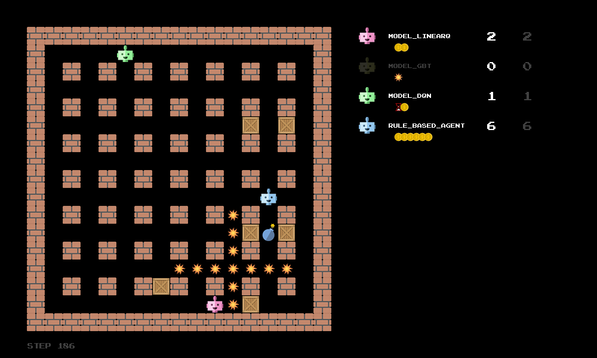

# MLE_Project

Team Agent GASY, Machine Learning Essentials, SS 2026.
Submitted to the tournament: `agent_code/model_linearQ`, entered as "Agent GASY".

    agent_code/model_linearQ   the submitted agent — linear Q-learning, Expected SARSA(lambda)
    agent_code/forestq         fitted Q-iteration, random forests; holds the 28-feature contract
    agent_code/model_gbt       fitted Q-iteration, gradient-boosted trees, same contract
    agent_code/my_agent        Double DQN, its own feature set

Everything behind the numbers in the report lives in two folders:
`experiments/` holds the scripts, pre-registrations, and weight files for every
run; `results/` holds the raw output, one folder per model.

Extra libraries are in `requirements.txt`.

---

# bomberman_rl

Setup for a project/competition amongst students to train a winning Reinforcement Learning agent for the classic game Bomberman.